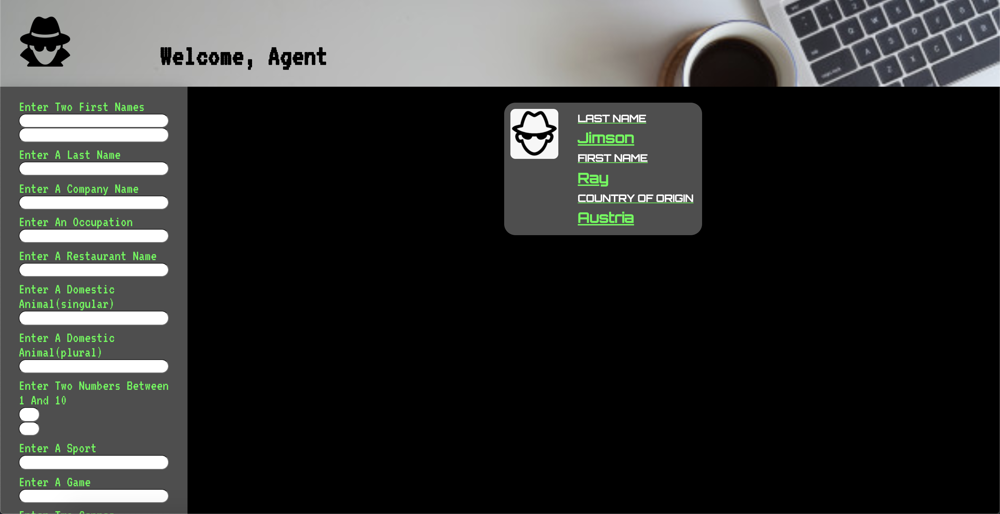
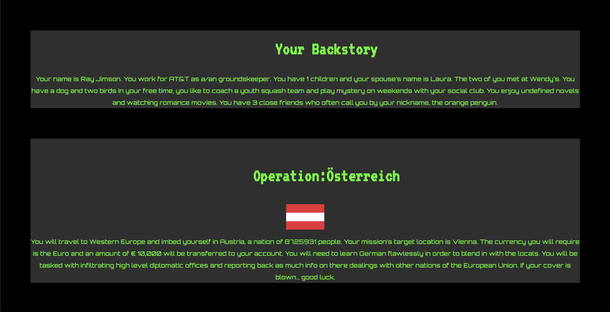

## About The Project

This project is part of Turing Software and Designs' Front-End Program, Module 3. The project focuses on creating an original application using a stretch technology. It implements  ES6 syntax and Redux (stretch technology) into our React application. One database was accessed, representing a large chunk of data for the countries of the world. Our task was to use the Redux state management system to allow users to create and store secret identities. Each identity also contains a backstory, a mission report, and a flag representing the country of their choice. This program also incorporates the use of thunk functions, React-hooks, and the React/Jest testing libraries.

### Built With

* Redux
* React
* React-Hooks
* Thunk

### Installation
In your terminal:
1. Clone the repo- git@github.com:taylorjohnson141/identity-maker.git

2. Install NPM packages- `npm install`

## Usage

### User Experience

#### Homepage (With an Identity Card)

#### Identity Backstory and Mission Area

## Roadmap

The total time allotted for this project was approximately 10 days. Future features contemplated by the developers include the following:

* Allowing a user to edit or delete their identity cards
* Use the countries API data to display more information about a certain country and how it can help the user’s mission.

## Contact

 [Eric Berglund](https://github.com/ericberglund117)

 [Tim Keresey](https://github.com/timkeresey)

 [Taylor Johnson](https://github.com/taylorjohnson141)

Project Link: [Identity-Maker Repo](https://github.com/taylorjohnson141/identity-maker)

## Extensions
Have a faux-welcome page with a riddle/clue/quiz that the user must correctly guess in order to be directed to the Identity-maker homepage. It’s like the spy’s secret code to get into the application.
Add animations
Make a quiz so user has to remember the country and their identity
When flag is clicked more information is displayed about country

## Acknowledgements

James Bond

Khalid Williams - This developer team would like to thank Turing Module 3 instructor, Khalid Williams, for his assistance throughout this project and for his daily lessons on the magic of React.
Leta Keane - We would also like to thank Turing Module 3 instructor, Leta Keane, for her guidance and assistance on this project and the module in general.
